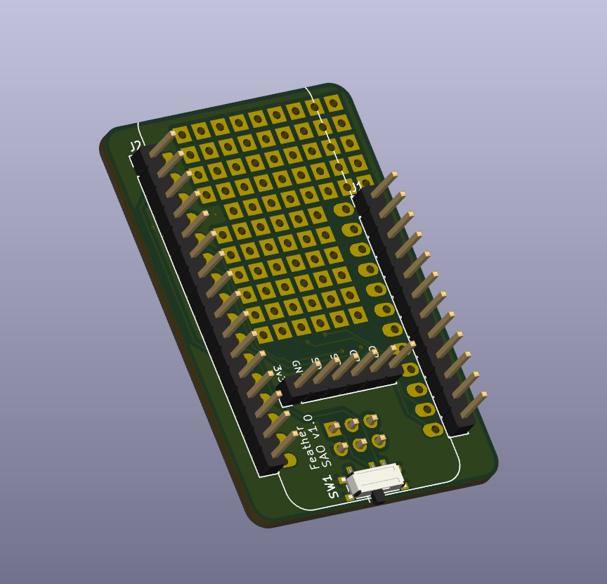

# Feather SAO

This SAO (SuperCon Add-On) was made to let me put an Adafruit feather board, like the Hallowing M0 or EdgeBadge or PyBadge handed out at previous supercon onto the badge as an SAO.

There's a swith at the bottom to connect the 3.3v pin to the feather to the 3.3v on on the SAO connector. Turn it off if you're connecting USB or your own battery, and turn it on to power your feather device from the badge's SAO connector.

