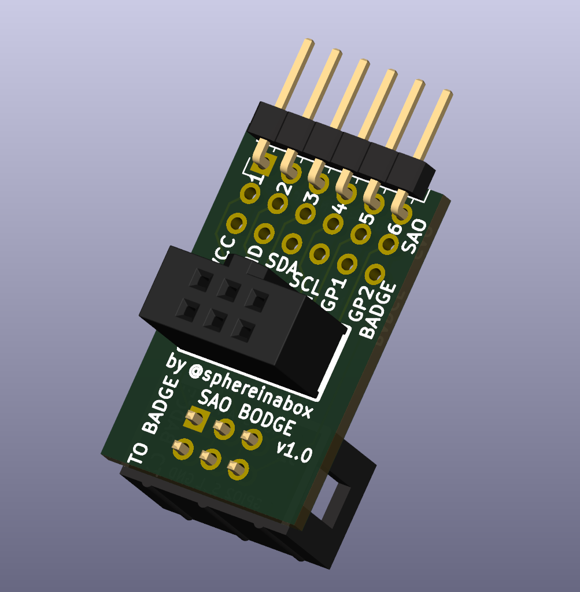
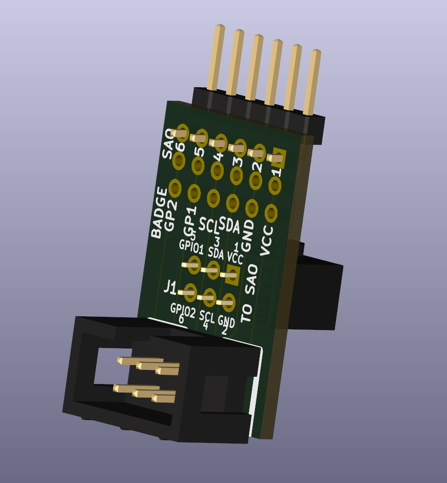

# SAO-BODGE Shim

This SAO (SuperCon Add-On) shim goes between your badge and your SAO to break out the SAO pins, and shuffle or disconnect them if needed

This was inspired by the DigiKey SAO which was built with the wrong connector on the SAO so pins were flipped, but also used the SAO pins as MCU programming pins. 
I've built another board for the DigiKey SAO that reverses the pins by default. See DK-SAO-BODGE

 

This is also useful to use as a SAO pin breakout to connect a logic analyzer to, such as using Raspberry Pi Pico with Sigrok/Pulseview.