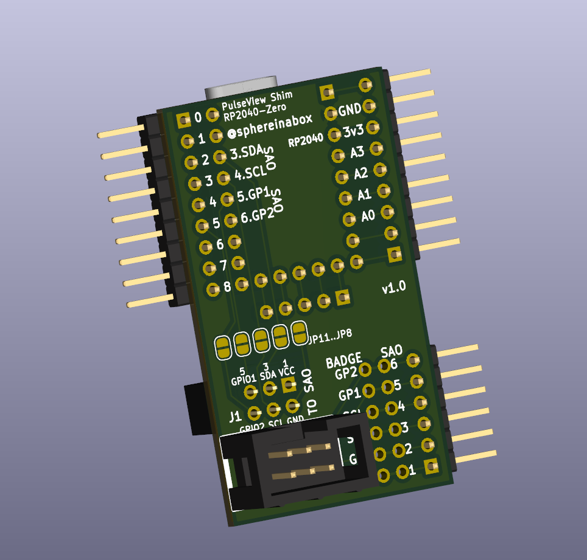

# SAO-RP2040 Shim

This SAO (SuperCon Add-On) shim goes between your badge and your SAO to break out the SAO pins, and shuffle or disconnect them if needed

But it also connects an RP2040-Zero, to use with the pulseview from the open source sigrok project and the sigrok-rp2040 pi pico firmware see https://github.com/pico-coder/sigrok-pico/ and https://github.com/pico-coder/sigrok-pico/blob/main/AnalyzerDetails.md

 

I've connected the SAO pins to D2-D4 on the RP2040-zero. If you'd also like to connect them to the analog inputs use jumpers from the SAO pin breakouts to the analog input pin breakouts.
